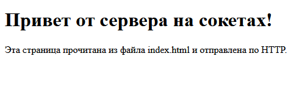
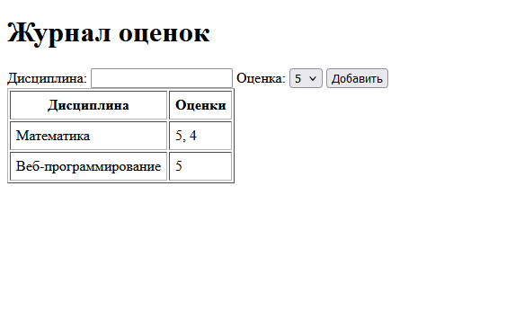

# Лабораторная работа 1. Работа с сокетами

**Студент:** Смирнов Фёдор, группа K3340.

**Цель работы:** понять принципы взаимодействия через сокеты и научиться реализовывать базовую архитектуру клиент-сервер.

Задания выполнены на Python с библиотекой `socket`, в чате дополнительно используется `threading`. Каждое задание лежит в своей папке `students/K3340/Smirnov_Fedor/laboratory_work_1/<папка>`. Сервер и клиент запускаются в разных терминалах, сначала сервер.

## Задание 1. Обмен сообщениями по UDP

Клиент отправляет серверу «Hello, server», сервер выводит сообщение и отвечает «Hello, client».

UDP работает без соединения, поэтому у сервера нет `listen()` и `accept()`. Сервер ждёт датаграмму в `recvfrom()`, который возвращает данные и адрес отправителя, и отвечает на этот адрес через `sendto()`.

```python
import socket

ADDRESS = ("localhost", 5001)

with socket.socket(socket.AF_INET, socket.SOCK_DGRAM) as sock:
    sock.bind(ADDRESS)
    print("UDP-сервер запущен на", ADDRESS)

    while True:
        data, address = sock.recvfrom(1024)
        print(f"Получено от {address}: {data.decode()}")
        sock.sendto("Hello, client".encode(), address)
```

```python
import socket

ADDRESS = ("localhost", 5001)

with socket.socket(socket.AF_INET, socket.SOCK_DGRAM) as sock:
    sock.sendto("Hello, server".encode(), ADDRESS)
    data, _ = sock.recvfrom(1024)
    print(f"Ответ сервера: {data.decode()}")
```

```text
> python 1_udp/server.py
UDP-сервер запущен на ('localhost', 5001)
Получено от ('127.0.0.1', 63117): Hello, server

> python 1_udp/client.py
Ответ сервера: Hello, client
```

## Задание 2. Вычисления через TCP

Номер в списке 27, **вариант 3**: площадь трапеции `S = (a + b) / 2 * h`.

Клиент запрашивает с клавиатуры основания и высоту и отправляет их одной строкой через пробел. Сервер принимает соединение через `accept()`, считает площадь и отправляет результат строкой. Если пришли не три числа или значения не положительные, сервер возвращает текст ошибки.

```python
import socket

ADDRESS = ("localhost", 5002)


def trapezoid_area(a, b, h):
    return (a + b) / 2 * h


with socket.socket(socket.AF_INET, socket.SOCK_STREAM) as sock:
    sock.bind(ADDRESS)
    sock.listen()
    print("TCP-сервер запущен на", ADDRESS)

    while True:
        conn, address = sock.accept()
        with conn:
            request = conn.recv(1024).decode()
            print(f"{address}: {request}")

            try:
                a, b, h = map(float, request.split())
                if min(a, b, h) <= 0:
                    answer = "Ошибка: основания и высота должны быть больше нуля"
                else:
                    answer = f"Площадь трапеции: {trapezoid_area(a, b, h)}"
            except ValueError:
                answer = "Ошибка: нужно передать три числа"

            conn.sendall(answer.encode())
```

```python
import socket

ADDRESS = ("localhost", 5002)

print("Площадь трапеции: S = (a + b) / 2 * h")
a = input("Основание a: ")
b = input("Основание b: ")
h = input("Высота h: ")

with socket.socket(socket.AF_INET, socket.SOCK_STREAM) as sock:
    sock.connect(ADDRESS)
    sock.sendall(f"{a} {b} {h}".encode())
    print(sock.recv(1024).decode())
```

```text
> python 2_tcp/client.py
Площадь трапеции: S = (a + b) / 2 * h
Основание a: 3
Основание b: 5
Высота h: 4
Площадь трапеции: 16.0

> python 2_tcp/client.py
Площадь трапеции: S = (a + b) / 2 * h
Основание a: 3
Основание b: 5
Высота h: -4
Ошибка: основания и высота должны быть больше нуля
```

## Задание 3. HTML-страница по HTTP

Сервер читает `index.html` и отправляет его браузеру в HTTP-ответе: строка статуса, заголовки, пустая строка и тело. Файл читается в байтах, потому что `Content-Length` указывается в байтах.

```python
import socket
from pathlib import Path

ADDRESS = ("localhost", 8080)
PAGE = Path(__file__).parent / "index.html"

with socket.socket(socket.AF_INET, socket.SOCK_STREAM) as sock:
    sock.bind(ADDRESS)
    sock.listen()
    print("HTTP-сервер запущен: http://localhost:8080")

    while True:
        conn, address = sock.accept()
        with conn:
            request = conn.recv(1024).decode()
            print(address, request.split("\r\n")[0])

            body = PAGE.read_bytes()
            headers = (
                "HTTP/1.1 200 OK\r\n"
                "Content-Type: text/html; charset=utf-8\r\n"
                f"Content-Length: {len(body)}\r\n"
                "Connection: close\r\n"
                "\r\n"
            )
            conn.sendall(headers.encode() + body)
```

```html
<!DOCTYPE html>
<html lang="ru">
<head>
    <meta charset="utf-8">
    <title>Лабораторная работа 1</title>
</head>
<body>
    <h1>Привет от сервера на сокетах!</h1>
    <p>Эта страница прочитана из файла index.html и отправлена по HTTP.</p>
</body>
</html>
```

Страница по адресу `http://localhost:8080`:



```text
> python 3_http/server.py
HTTP-сервер запущен: http://localhost:8080
('127.0.0.1', 19402) GET / HTTP/1.1
('127.0.0.1', 19404) GET /favicon.ico HTTP/1.1
```

## Задание 4. Многопользовательский чат

Чат работает по TCP. Сервер принимает подключения в главном потоке и для каждого клиента запускает отдельный поток. Подключённые пользователи хранятся в словаре, где сокету каждого клиента соответствует его имя. Доступ к словарю защищён блокировкой `threading.Lock`.

Первым сообщением клиент отправляет своё имя. Остальные сообщения сервер рассылает всем, кроме отправителя, в виде `имя: текст`. Команда `/exit` завершает сеанс. В клиенте сообщения принимаются в отдельном потоке, пока основной поток ждёт ввод.

```python
import socket
import threading

ADDRESS = ("localhost", 5004)

users = {}
lock = threading.Lock()


def send_all(text, sender=None):
    with lock:
        receivers = [conn for conn in users if conn is not sender]

    for conn in receivers:
        try:
            conn.sendall((text + "\n").encode())
        except OSError:
            pass


def serve(conn, address):
    name = conn.recv(1024).decode().strip()
    with lock:
        users[conn] = name
    print(f"Подключение: {name} {address}")
    send_all(f"{name} присоединяется к чату", conn)

    try:
        while True:
            text = conn.recv(1024).decode().strip()
            if not text or text == "/exit":
                break
            print(f"{name}: {text}")
            send_all(f"{name}: {text}", conn)
    except ConnectionError:
        pass
    finally:
        with lock:
            del users[conn]
        conn.close()
        print(f"Отключение: {name}")
        send_all(f"{name} покидает чат")


with socket.socket(socket.AF_INET, socket.SOCK_STREAM) as sock:
    sock.bind(ADDRESS)
    sock.listen()
    print("Чат запущен на", ADDRESS)

    while True:
        conn, address = sock.accept()
        threading.Thread(target=serve, args=(conn, address), daemon=True).start()
```

```python
import socket
import threading

ADDRESS = ("localhost", 5004)


def receive(sock):
    while True:
        try:
            data = sock.recv(1024)
        except OSError:
            break
        if not data:
            print("Сервер закрыл соединение")
            break
        print(data.decode(), end="")


sock = socket.socket(socket.AF_INET, socket.SOCK_STREAM)
sock.connect(ADDRESS)
sock.sendall(input("Ваше имя: ").encode())

threading.Thread(target=receive, args=(sock,), daemon=True).start()
print("Вы в чате. Для выхода введите /exit")

while True:
    message = input()
    if not message.strip():
        continue
    try:
        sock.sendall(message.encode())
    except OSError:
        print("Сервер недоступен")
        break
    if message == "/exit":
        break

sock.close()
```

Три пользователя запустили один и тот же `client.py`, Борис вышел командой `/exit`:

```text
> python 4_chat/client.py
Ваше имя: Фёдор
Вы в чате. Для выхода введите /exit
Анна присоединяется к чату
Борис присоединяется к чату
Всем привет!
Анна: Привет, Фёдор
Борис покидает чат
Борис вышел, мы остались вдвоём

> python 4_chat/server.py
Чат запущен на ('localhost', 5004)
Подключение: Фёдор ('127.0.0.1', 19375)
Подключение: Анна ('127.0.0.1', 19376)
Подключение: Борис ('127.0.0.1', 19377)
Фёдор: Всем привет!
Анна: Привет, Фёдор
Отключение: Борис
Фёдор: Борис вышел, мы остались вдвоём
```

## Задание 5. Веб-сервер для журнала оценок

Сервер сделан на основе класса `MyHTTPServer` из материалов к заданию. Запрос разбирается вручную: первая строка, заголовки до пустой строки и тело длиной `Content-Length`.

На запрос `GET /` сервер отдаёт страницу с формой и журналом и код `200 OK`. Запрос `POST /` приходит из формы с дисциплиной и оценкой: сервер сохраняет оценку и отвечает `303 See Other` с заголовком `Location: /`, после чего браузер снова загружает главную страницу. Если дисциплина пустая или оценка не от 2 до 5, сервер ничего не сохраняет и отвечает `400 Bad Request`. На любой другой адрес приходит `404 Not Found`.

Журнал хранится в словаре, в котором для каждой дисциплины записан список её оценок: `{"Математика": [5, 4]}`. Поэтому у каждой дисциплины одна строка в таблице.

```python
import socket
from urllib.parse import parse_qs


class MyHTTPServer:
    def __init__(self, host, port):
        self.host = host
        self.port = port
        self.grades = {}

    def serve_forever(self):
        server_socket = socket.socket(socket.AF_INET, socket.SOCK_STREAM)
        server_socket.bind((self.host, self.port))
        server_socket.listen(5)
        print(f"Сервер запущен: http://{self.host}:{self.port}")

        while True:
            client_socket, client_address = server_socket.accept()
            self.serve_client(client_socket)

    def serve_client(self, client_socket):
        rfile = client_socket.makefile("rb")
        try:
            method, path, version = self.parse_request(rfile)
            headers = self.parse_headers(rfile)

            content_length = int(headers.get("Content-Length", 0))
            body = rfile.read(content_length).decode()

            print(f"Запрос: {method} {path}")
            self.handle_request(client_socket, method, path, body)
        except Exception as error:
            print(f"Не удалось обработать запрос: {error}")
        finally:
            rfile.close()
            client_socket.close()

    def parse_request(self, rfile):
        request_line = rfile.readline().decode().strip()
        parts = request_line.split()
        if len(parts) != 3:
            raise ValueError("некорректная строка запроса")
        method, path, version = parts
        return method, path, version

    def parse_headers(self, rfile):
        headers = {}
        while True:
            line = rfile.readline().decode().strip()
            if not line:
                break
            name, value = line.split(":", 1)
            headers[name.strip()] = value.strip()
        return headers

    def handle_request(self, client_socket, method, path, body):
        if method == "GET" and path == "/":
            self.send_response(client_socket, "200 OK", self.render_page())

        elif method == "POST" and path == "/":
            params = parse_qs(body)
            discipline = params.get("discipline", [""])[0].strip()
            grade = params.get("grade", [""])[0]

            if not discipline or grade not in ("2", "3", "4", "5"):
                self.send_response(
                    client_socket,
                    "400 Bad Request",
                    "<h1>400 Bad Request</h1><p>Нужны дисциплина и оценка от 2 до 5</p>",
                )
                return

            if discipline not in self.grades:
                self.grades[discipline] = []
            self.grades[discipline].append(int(grade))
            print(f"Добавлена оценка: {discipline} - {grade}")

            self.send_response(client_socket, "303 See Other", "", location="/")

        else:
            self.send_response(client_socket, "404 Not Found", "<h1>404 Not Found</h1>")

    def send_response(self, client_socket, status, body, location=None):
        body_bytes = body.encode()

        response = f"HTTP/1.1 {status}\r\n"
        response += "Content-Type: text/html; charset=utf-8\r\n"
        response += f"Content-Length: {len(body_bytes)}\r\n"
        response += "Connection: close\r\n"
        if location:
            response += f"Location: {location}\r\n"
        response += "\r\n"

        client_socket.sendall(response.encode() + body_bytes)

    def render_page(self):
        rows = ""
        for discipline, grades in self.grades.items():
            grades_text = ", ".join(str(grade) for grade in grades)
            rows += f"<tr><td>{discipline}</td><td>{grades_text}</td></tr>\n"

        if not rows:
            rows = '<tr><td colspan="2">Оценок пока нет</td></tr>'

        return f"""<!DOCTYPE html>
<html lang="ru">
<head>
    <meta charset="utf-8">
    <title>Журнал оценок</title>
</head>
<body>
    <h1>Журнал оценок</h1>

    <form method="POST" action="/">
        <label>Дисциплина: <input type="text" name="discipline" required></label>
        <label>Оценка:
            <select name="grade">
                <option>5</option>
                <option>4</option>
                <option>3</option>
                <option>2</option>
            </select>
        </label>
        <button type="submit">Добавить</button>
    </form>

    <table border="1" cellpadding="6">
        <tr><th>Дисциплина</th><th>Оценки</th></tr>
        {rows}
    </table>
</body>
</html>"""


if __name__ == "__main__":
    server = MyHTTPServer("localhost", 8081)
    server.serve_forever()
```

Добавлены оценки 5 и 4 по математике и 5 по веб-программированию:



```text
> python 5_journal/server.py
Сервер запущен: http://localhost:8081
Запрос: GET /
Запрос: GET /favicon.ico
Запрос: POST /
Добавлена оценка: Математика - 5
Запрос: GET /
Запрос: GET /favicon.ico
Запрос: POST /
Добавлена оценка: Математика - 4
Запрос: GET /
Запрос: GET /favicon.ico
Запрос: POST /
Добавлена оценка: Веб-программирование - 5
Запрос: GET /
Запрос: GET /favicon.ico
```

## Вывод

В работе реализованы обмен сообщениями по UDP и TCP, отдача HTML-страницы по HTTP, многопользовательский чат на потоках и веб-сервер с обработкой GET и POST. UDP отправляет данные без соединения, TCP сначала устанавливает его, а HTTP передаётся поверх TCP обычным текстом, который можно разобрать и собрать вручную.
